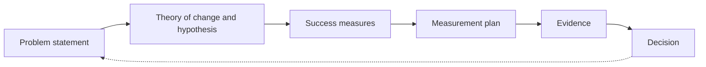

# The workshop pages and the golden thread

The method lives on the site as four stage pages plus the evidence page. Each
page shows a worked example for the sports-facilities scenario, structured
around the tools for that stage, and ends with what the group must hand in.

| Stage | Page | Tools shown | The group hands in |
|---|---|---|---|
| **1 Discover** (before build) | `discover.html` | Stakeholder map, interview guide, data analysis output, as-is process map with pain points, key assumptions | A **problem statement** |
| **2 Define** (during build) | `define.html` | User groups, user needs, business needs, theory of change, to-be process map, user story map, acceptance criteria per story, success measures | **Users, user stories with acceptance criteria, new process flow, hypothesis for change, success measures** |
| **3 Build** | `index.html` | The booking site itself, rendered from the Define hand-in | Nothing; they test it against their acceptance criteria |
| **4 Evaluate** (after build) | `evaluate.html` | The question chain, theory-of-change links, fake pilot results against the group's measures, a builder for additional data needed, a source guide | **Pilot results and additional data needed** (copied from the page) |
| Handout (not in the menu) | `handout.html` | Post-session revision handout: the golden thread, everything the group produced at each stage, the fake results, takeaways and a glossary. Rendered from all four configs; prints to PDF | Nothing |
| Evidence (not in the menu) | `evidence.html` | Fictional pilot results generated from the measurement plan, under the evaluation headings. Reached by URL only; the facilitator shares it if the optional third hand-in is used | A decision: continue, iterate, expand, pivot or stop |

## The golden thread

- The problem statement from Discover is carried, unchanged, to the top of Define.
- The hypothesis and success measures from Define are carried to the top of the evidence page.
- The measurement plan from Evaluate says what data to generate.
- The decision at the end restarts discovery. That is why BA is continuous.

## Interactive pages

Discover and Define are worksheets, not just examples. Participants type on
the page and it is saved in their browser. Each page has a "Reset this page"
button. The example answers, intended stakeholder placement, interview scripts
and example theory of change are shown only in facilitator view: open a page
with `?facilitator=1` (turn off with `?facilitator=0`).

| Page | What the group does |
|---|---|
| Discover | Drag stakeholders onto the grid; read what PM and UX colleagues already heard; run and record two interviews (CFO, reception staff); read the data and take a true/false quiz; annotate the as-is process with pain points; add an assumption; compose the problem statement with agreement, size of prize and watch-outs; copy it |
| Define | Rank five business needs and say who disagrees; write the theory of change; give feedback on the UX colleague's to-be map and the PM's story map; name success measures and their sources; copy the compiled hand-in |
| Evaluate | See fake pilot results against their own measures; answer "So what next?" (invest, iterate, pause, pivot or stop, and why). If there is time, build the list of additional data needed and copy it |

## How the hand-ins reach the site

Every page renders from a config file. When the facilitator pastes a hand-in
into Claude, Claude updates the config and pushes; GitHub Pages redeploys in a
minute or two. The plain-text templates for the hand-ins are in
`hand-in-templates.md` and are also shown, with a copy button, at the bottom of
the Discover and Define pages.

| Hand-in | Config files updated |
|---|---|
| Problem statement | `config/discovery.js`, `config/define.js` |
| Define outputs | `config/define.js`, `config/mvp.js` (drives the booking site), `config/evidence.js` (the "set out to do" section) |
| Pilot results and additional data needed | `config/evidence.js` (evidence generated for each row, consistent with the results shown) |

See `CLAUDE.md` for the exact mapping.
